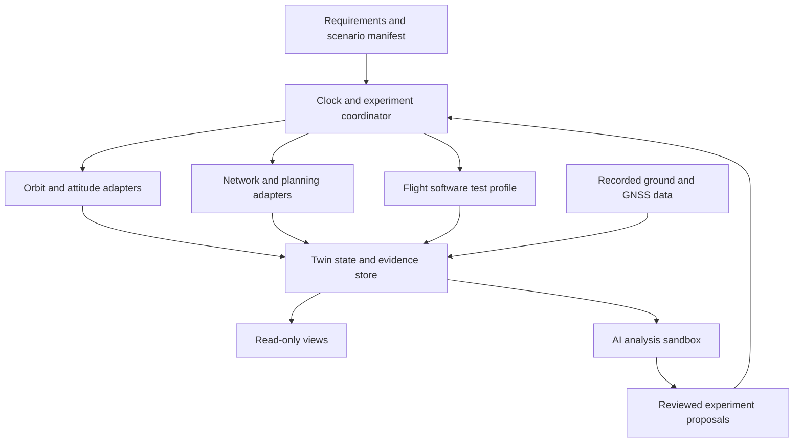

# jfxai4scss — AI-Powered Satellite Simulation Platform

An alternative, modular integration architecture for satellite simulation, digital twins, spacecraft software testing, ground systems and satellite networks, prioritizing open-source components and reproducible AI research.

**Status:** architecture and documentation proposal. Inclusion in this catalog does not mean that an adapter exists, that components are mutually compatible, or that numerical or operational validation has been completed. Source descriptions were reviewed on 2026-09-20. Candidate availability, licenses, dependencies and maintenance must be checked for each pinned release.

## Scope and objectives

- Connect mission requirements, constellation geometry, spacecraft dynamics, communications, ground observations and software-in-the-loop experiments.
- Build digital twins that retain model identity, timestamp, coordinate frame, configuration, uncertainty and provenance.
- Compare routing, scheduling and telemetry-analysis algorithms against reproducible non-AI baselines.
- Support separate orbital, networking, ground-replay, spacecraft-software and atmospheric HAPS profiles.
- Keep visualization, simulation and operational spacecraft control separate. The initial scope is offline simulation and recorded-data replay.

The project proposes a federation of specialized tools rather than a single replacement solver. A rendered satellite is a visualization; it becomes part of a digital-twin workflow only when connected to versioned models, observations and validation evidence.

## Integration architecture



| Layer | Responsibility | Candidate components |
|---|---|---|
| Requirements and engineering | Mission constraints, interface requirements, model traceability | Arcadia/Capella; MBSE/CAD/CAS assets |
| Experiment coordination | Scenario loading, seeds, time policy, adapter lifecycle, replay | Proposed jfxai4scss coordinator; Eclipse MOSAIC only through qualified custom adapters |
| Orbital and structural models | Ephemerides, access windows, attitude and flexible modes | OSTk, SatLib, FlexibleSpacecraft |
| Planning and networks | Contacts, scheduling, routing, queues and link availability | SPRINT, SNS-3, MA-DRL, LSNS; OpenSAND, OpenSN, TinyLEO and SNK for selected emulation profiles |
| Flight software testing | Host-based software execution, device models, telemetry replay | NOS3; KubOS and CubeSat HIL after qualification |
| Ground, navigation and RF | Observations, receiver outputs, station coordinates, antenna patterns | SatNOGS, GNSS-SDR, GNSSTk, SALSA, openEMS/Octave |
| Twin and presentation | Versioned state, events, comparisons, observability and 3D views | Proposed common data layer; SMCSS, OrbitIQ and Bevy-based simulator as candidate front ends |
| AI | Anomaly analysis, retrieval, surrogates and bounded planning experiments | Optional independently licensed training and local-inference packages; no mandatory hosted AI service |

Adapters should be independent processes where practical, communicating through versioned files or documented APIs. Python, Julia, C++, Rust, Java and simulation-engine runtimes should not be forced into a shared dependency environment. Containers are useful for isolation but are not required by every profile.

### Digital-twin contracts

Each experiment manifest should identify the scenario, model revisions, input hashes, adapter versions, seeds, time interval, tolerances and expected outputs.

| Contract | Required information |
|---|---|
| Asset identity | Stable spacecraft/station/link ID; model and configuration revision; source |
| Orbit | Epoch, time scale, reference frame, central body, position/velocity units, propagator and input provenance |
| Attitude and structure | Quaternion convention, body frame, angular-rate units, flexible-model revision |
| Orbit observations | TLE or other source, retrieval time, validity assumptions and freshness flag |
| Contact opportunity | Endpoints, start/end, geometric constraints and assumptions; not automatically a successful RF link |
| RF/link state | Frequency, bandwidth, antenna-pattern reference, link budget assumptions, availability and applicable environment |
| Network traffic | Offered load, packet size, route, queue policy, timestamps, losses and delay definitions |
| Telemetry/event | Asset ID, event and receipt time, units, quality flags, schema version and recorded/synthetic origin |
| Results | Metrics, uncertainty, logs, baseline, validation checks and provenance |

TEME, GCRS, ITRS/ECEF and local ENU/NED coordinates are not interchangeable. Explicit transformations and consistent UTC/TAI handling are required. Do not silently infer frames from a simulator's display coordinates.

### Cross-domain exchanges

| Producer → consumer | Proposed exchange | Integration gate |
|---|---|---|
| Dynamics → network | Ephemerides, visibility and contact windows | Frame/time conversion and independently checked geometry |
| Planner → network | Contact schedule and candidate routes | Capacity, causality and availability constraints |
| Simulator → emulator | Time-indexed delay/loss/bandwidth profile | Explicit wall-clock versus simulation-clock mapping |
| Ground archive → twin | Recorded telemetry and observations | Timestamp alignment, provenance and missing-data handling |
| Flight software → twin | Telemetry/events and simulated device state | Schema agreement and isolated test interfaces |
| Geodesy/GNSS → station model | Coordinates, receiver estimates, covariance where available | Datum, epoch, units and quality checks |
| Twin → visualization | Read-only snapshots and event streams | Backpressure; rendering must not advance the physics clock |
| AI → coordinator | Candidate experiment configurations | Schema validation and review before a new simulation run |

Conservative synchronization or recorded trace replay is the initial integration approach. Different solvers need not share one timestep. Any live co-simulation must document lookahead, interpolation, timeout, rollback policy where supported, and causal ordering.

## Open-source AI integration

AI is an optional analysis layer. Model weights, training data and inference libraries require their own license checks; an open-source runtime does not imply openly licensed weights or datasets.

| Capability | Inputs and outputs | Evaluation and boundary |
|---|---|---|
| Source-grounded engineering assistant | Approved documentation → cited explanations and adapter suggestions | Source traceability; no fabricated APIs or claims of implemented integration |
| Experiment assistant | Validated scenario schema → proposed parameter studies | Deterministic validation and reviewed execution |
| Telemetry anomaly detection | Recorded/synthetic time series → scored anomalies | Compare with threshold/statistical baselines; report false alarms, missed events and drift |
| Routing and scheduling research | Synthetic contact graphs and queues → candidate policies | Compare with shortest-path/contact-plan baselines; hold out constellation scenarios |
| Reduced-order/surrogate models | Solver datasets → accelerated estimates | Error bounds, domain checks and fallback to the reference solver |
| Conjunction research | Propagated states and uncertainty → screening indicators | Distinguish proximity and heuristic scores from calibrated collision probability |
| Retrieval and provenance | Versioned sources → searchable evidence | Retain source version, citation and access restrictions |

Training and evaluation datasets must be separated by mission or scenario where appropriate to prevent leakage. Record seeds, checkpoints, training configuration, inference cost and failure cases.

A future bounded tool interface, including an optional MCP adapter, could expose schema inspection, archived-run queries and isolated simulation launches. Such an interface is proposed, not implemented. No live spacecraft commands or autonomous collision-avoidance maneuvers are part of the MVP.

## Categorized simulation compendium

Links identify candidate sources, not endorsed or tested dependencies. “Pending identification” entries remain in the catalog to preserve scope without guessing their upstream identity.

### 1. Mission applications, tracking and conjunction studies

| Candidate | Role in the architecture | Qualification notes |
|---|---|---|
| [SMCSS](https://github.com/preslaff/satellite-mission-control-simulation-system) — Satellite Mission Control Simulation System | Mission dashboard, tracking, telemetry/application integration reference | Development-stage application; distinguish existing tracking components from planned ML features |
| [OrbitShield / Orbital Risk Engine](https://github.com/nitin864/Orbital-Risk-Engine) | TLE ingestion, propagation and proximity-screening research | Risk scores are not automatically validated collision probabilities; not an operational avoidance service |
| [OrbitIQ Explorer](https://github.com/mahin-aeroai/ORBITIQ-Explorer) | Interactive 3D satellite tracking and presentation | Qualify backend data freshness and frame handling; visualization is not a dynamics-validation reference |

### 2. Orbital dynamics, constellations and coupled spacecraft models

| Candidate | Role in the architecture | Qualification notes |
|---|---|---|
| [FlexibleSpacecraft](https://github.com/Mizu49/FlexibleSpacecraft.jl) | Julia spacecraft attitude–structure coupling simulation | Qualify model assumptions, numerical settings and interfaces independently |
| [SatLib](https://github.com/manweichan/SatLib) | Python constellation calculations, propagation and contact studies | Upstream development and older dependency environment require a pinned, tested profile |
| [Open Space Toolkit (OSTk)](https://github.com/open-space-collective/open-space-toolkit) | Aerospace data structures and selected dynamics/astrodynamics modules | Select and pin the actual subpackages; the umbrella repository is not a complete mission application |
| [Satellite Constellation Creator](https://github.com/SaberAidan/SatelliteConstellationCreator) | Historical constellation-parameter generation reference | Repository is deprecated and redirects to [a successor](https://gitlab.com/open-galactic/satellite-constellation); successor contents must be qualified before adoption |
| [Bevy-based LEO satellite simulator](https://github.com/LTstrange/satellite-simulator) | Rust/Bevy visualization and experimental communications/offloading scenarios | Independently benchmark orbital fidelity, scale and timing claims |

### 3. HAPS and solar-powered atmospheric platforms

| Candidate | Role in the architecture | Qualification notes |
|---|---|---|
| [HAPS Glider / ASFS](https://github.com/AristidesAI/AI-HAPS-Ardupilot) | Atmospheric platform, solar-energy and station-keeping architecture reference | ArduPilot/companion-system integration; atmospheric flight is a separate domain from orbital mechanics |
| [Solar-powered autonomous glider simulation](https://github.com/sdk2035/HighEfficiencyGlide) | Energy-aware glider modeling and control reference | Qualify fork/upstream relationship and component dependencies; no assumed orbit-propagator compatibility |

HAPS may connect to satellite-network scenarios through position, power and connectivity traces. Its aerodynamics, weather and solar-energy models remain a separate execution profile.

### 4. GNSS, navigation and ground-station geodesy

| Candidate | Role in the architecture | Qualification notes |
|---|---|---|
| [GPS Toolkit (GPSTk)](https://github.com/SGL-UT/GPSTk) | Historical GNSS processing reference | Archived/renamed; evaluate [GNSSTk](https://github.com/SGL-UT/gnsstk) and [applications](https://github.com/SGL-UT/gnsstk-apps) for new work |
| [GNSS-SDR](https://github.com/gnss-sdr/gnss-sdr) | Software-defined GNSS receiver and recorded-signal processing | Start with recorded data; document hardware, sampling and GPL licensing requirements |
| [SALSA](https://github.com/SGL-UT/SALSA) | Rigorous 3D geodetic least-squares adjustment for station/reference geometry | Survey/geodesy tool, not an orbital propagator; retain datum, epoch and uncertainty |

### 5. Planning, routing and network simulation

| Candidate | Role in the architecture | Qualification notes |
|---|---|---|
| [Scheduling Planning Routing Inter-satellite Networking Tool (SPRINT)](https://github.com/MIT-STARLab/SPRINT) | Mission scheduling and inter-satellite planning | Pin circinus dependencies; verify access to required submodules and older runtime requirements |
| [Multi-Agent DRL Routing Simulator](https://github.com/SatCom-TELMA/MA-DRL_Routing_Simulator) | SimPy-based routing/latency and reinforcement-learning experiments | Preserve non-learning baselines and scenario-separated evaluation |
| [LSNS](https://github.com/infonetlijian/Large-Scale-Satellite-Network-Simulator-LSNS) | ONE-based large-scale satellite-network research | Upstream notes limited public features/updates; qualify supported scenarios |
| [Satellite Network Simulator 3 (SNS-3)](https://github.com/sns3/sns3-satellite) | Satellite extension for ns-3 and packet-level network studies | Pin compatible ns-3 and companion modules; check licenses across modules |
| [OS3 — Open Source Satellite Simulator](https://github.com/inet-framework/os3) | Historical OMNeT++/INET satellite-communication framework | Older OMNeT++/INET dependencies require isolation; do not assume current-version compatibility |
| [Eclipse MOSAIC](https://github.com/eclipse-mosaic/mosaic) | Possible cross-domain mobility co-simulation coordinator | Primarily connected/automated mobility; satellite behavior requires custom adapters and validation |

### 6. Network emulation and distributed execution

| Candidate | Role in the architecture | Qualification notes |
|---|---|---|
| [vce — Virtual Constellation Engine](https://github.com/isi-rcg/vce) | Cloud-hosted satellite application prototyping and network emulation | AWS infrastructure dependencies; not a vendor-neutral local deployment out of the box |
| [OpenSN](https://github.com/OpenSN-Library/OpenSN-Library) | Container-based LEO satellite-network emulation | Qualify host privileges, topology scale and time mapping; distinct from OpenSNK |
| [TinyLEO](https://github.com/TinyLEO-toolkit/TinyLEO) | Small-scale LEO networking and orchestration research | Validate physical/emulated topology limits and experiment repeatability |
| [SNK / OpenSNK](https://github.com/xdr940/OpenSNK) | Space Networking Kit simulation/emulation and scenario analysis | Treat as its own adapter family; do not conflate with OpenSN |
| [OpenSAND](https://github.com/CNES/opensand) | Satellite communication emulation, including DVB-based configurations | Validate supported standards/profile and GPL/LGPL component obligations |

Use emulation when the research question needs real applications or protocol stacks. Use discrete-event simulation when repeatable scenario scale and event causality are the priority. Results are comparable only with matched traffic, links, timing and metric definitions.

### 7. RF, multibeam coverage and antenna modeling

| Candidate | Role in the architecture | Qualification notes |
|---|---|---|
| [Multibeam Fixed-Satellite Service Simulator](https://github.com/9c9a/mfs3) | Multibeam coverage and fixed-satellite-service studies | MATLAB-based: public source does not make the execution environment fully free software |
| [openEMS and Octave helical antenna example](https://github.com/ephemeridis/antenna-simulations) | 433 MHz helical-antenna modeling reference for a LEO CubeSat scenario | Research geometry, not a validated flight antenna; export patterns and assumptions for link studies |

RF field solvers and network engines solve different problems. Exchange documented antenna patterns, gains, losses and link assumptions instead of implying interchangeable physics models.

### 8. Ground networks and command/telemetry frameworks

| Candidate | Role in the architecture | Qualification notes |
|---|---|---|
| [SatNOGS — Open Source Global Satellite Ground Station Network](https://satnogs.org/) | Ground-station ecosystem, observation discovery and recorded-data integration | Begin with read-only archives; respect API, data and hardware/software terms |
| Scepter | Requested one-to-many spacecraft command/control framework candidate | Exact authoritative repository, license and interfaces remain unidentified; no dependency or API asserted |
| Javelin | Requested ground-station tools candidate | Exact project identity remains unresolved; similarly named ground-station repositories do not establish equivalence |

Operational command interfaces require a separate authorized design and test process. This documentation proposes only simulated commands and recorded telemetry.

### 9. Flight software, operational simulation and HIL

| Candidate | Role in the architecture | Qualification notes |
|---|---|---|
| [CubeSat HIL Simulator](https://github.com/ARYA-mgc/cubsat_Simulation_with_HIL) | Hardware-in-the-loop research reference | MATLAB/hardware dependencies and inconsistent altitude/attitude terminology need clarification; HIL validation is not established by listing it |
| [NASA Operational Simulator for Space Systems (NOS3)](https://github.com/nasa/nos3) | Host-based flight-software, ground-system and simulated-device integration | Historically described as “for Small Satellites”; current scope/title is broader. Pin software and model versions |
| KubOS | Requested open-source satellite software stack reference | Authoritative upstream availability, maintenance, license and usable release must be re-established before adoption; no automatic NOS3 compatibility assumed |

## Execution profiles and admission gates

| Profile | Initial purpose | Required gate |
|---|---|---|
| Orbital baseline | One constellation, one dynamics backend, contact export | Frame/time tests and reference-case comparisons |
| Network simulation | Replay contact trace into one packet/event engine | Traffic conservation, delay and causality checks |
| Network emulation | Run isolated application traffic over trace-driven links | Wall-clock mapping, host permissions and repeatability |
| Ground replay | Ingest recorded observations and telemetry | Provenance, quality flags and missing-data tests |
| Flight software | Run a selected NOS3 example in isolation | Supported dependencies and deterministic telemetry checks |
| HAPS | Replay atmospheric position/energy traces | Separate aerodynamic/energy validation |
| AI research | Analyze archived runs or compare routing policies | Held-out tests, baseline comparisons and failure reporting |

Each catalog entry should progress through **identified → license/dependency qualified → adapter implemented → interface tested → scenario validated**. None is promoted solely because it appears in this README.

An admission record should capture the authoritative URL, pinned revision, license, dependency licenses, runtime, data rights, required hardware/cloud services, adapter owner and known limitations. MATLAB-only candidates and cloud-dependent stacks remain optional reference profiles unless a tested free-software alternative is provided.

## Engineering organization and proposed layout

The existing MBSE organization is retained:

- **MBSE:** requirements and architecture using the Arcadia method and Capella models.
- **CAD:** conceptual geometry and engineering representations.
- **CAM:** manufacturing and assembly studies when relevant; not generated by this integration proposal.
- **CAS:** end-to-end simulation, interfaces and performance analysis.

The following layout is a **target design**, not a claim that these files already exist:

```text
MBSE/
  CAD/
  CAM/
  CAS/
docs/
  architecture/
  catalog/
  validation/
schemas/
  scenario/
  twin-state/
  contact-plan/
adapters/
  dynamics/
  networks/
  ground/
  flight-software/
  visualization/
scenarios/
  orbital-baseline/
  ground-replay/
  haps-link/
ai/
  datasets/
  baselines/
  evaluation/
results/
  manifests/
  reports/
```

Large observations, checkpoints and generated simulation outputs should live in versioned artifact storage with checksums; repository manifests should describe how to obtain them.

## Implementation roadmap

1. Resolve catalog identities and licenses, particularly Scepter, Javelin and KubOS; record legacy/runtime restrictions.
2. Define versioned scenario and twin-state schemas with explicit time/frame/unit conventions.
3. Implement one dynamics adapter and a reproducible small-constellation contact-plan scenario.
4. Implement one network adapter using trace replay before attempting live co-simulation.
5. Add read-only ground telemetry replay and a visualization consuming the same state contract.
6. Add an isolated NOS3 software-test profile after dependency qualification.
7. Introduce one AI baseline task, such as telemetry anomaly scoring, using synthetic or approved recorded data.
8. Expand to routing research, HAPS links, RF-derived link models and selected emulators only after the preceding interfaces are validated.

No fixed performance, collision-prediction accuracy, hardware readiness or operational capability is promised by this roadmap.

## Verification strategy

| Area | Evidence needed |
|---|---|
| Dynamics | Known orbit cases; documented tolerances; epoch/frame round trips |
| Contacts | Independently checked visibility, station geometry and event boundaries |
| Networks | Packet accounting, matched loads, delay definitions, routing constraints |
| Replay | Repeatable ordering, gaps, stale data and clock-offset behavior |
| Software integration | Adapter schema tests, timeouts, failure isolation and version compatibility |
| AI | Non-AI baseline, held-out scenarios, uncertainty, drift and reproducible seeds |
| Digital twin | Trace from requirement and model revision through input data to result |
| HIL | Hardware-specific procedures and measured evidence, separate from software-only tests |

Documentation review verifies catalog coverage and consistency only. Numerical, integration, hardware and mission validation remain future implementation work.

## Getting started

This repository currently provides project descriptions and engineering assets. There is no universal installer or unified simulator command documented by this proposal.

```bash
git clone https://github.com/robotics-intelligent-systems/jfxai4scss.git
cd jfxai4scss
```

Choose one execution profile, qualify its upstream dependencies and record a reproducible reference scenario before adding an adapter. Contributions should include source attribution, schema/version details and evidence proportionate to their claims.

## Intellectual property, licensing and attribution

The initial concept multimedia resources are references and are intended to be replaced by sufficiently simplified abstract models. We do not claim authorship of third-party models or imagery. Numerical-analysis and non-profit intentions do not by themselves grant permission to redistribute referenced material; obtain the necessary permissions before publication.

Each linked project retains its own license and attribution requirements. Source availability is not equivalent to a free-software license, and a code license does not necessarily cover datasets, model weights, imagery or hardware designs. No repository-wide license grant is inferred from this catalog; establish an explicit project license before distributing new code under one.

## Documentation review record

This expansion categorizes the complete supplied compendium, proposes adapter boundaries and AI evaluation gates, preserves MBSE and attribution intent, and marks unresolved identities and legacy dependencies. It does not add executable adapters, change operational systems or claim successful simulation tests.
